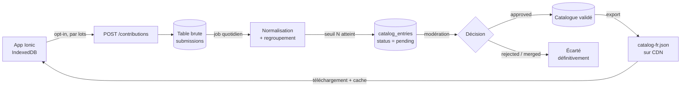

# StockIonic — Roadmap & décisions d'architecture

Ce document trace les décisions structurantes prises pour le projet, ainsi que les pistes
identifiées mais volontairement reportées. Il sert de mémoire de conception entre les sessions
de développement.

---

## Principe directeur

> **Offline d'abord.** On privilégie l'implémentation locale d'un maximum de fonctionnalités.
> Pas de backend tant que ce n'est pas strictement indispensable.

L'application est conçue comme une PWA offline-first : IndexedDB comme source de vérité,
aucune dépendance réseau au démarrage, aucun compte utilisateur.

---

## Décision — Les traductions restent dans des fichiers JSON

**Statut : actée (20/08/2026)**

Les traductions restent dans `src/assets/i18n/*.json`, chargées par `@ngx-translate` via
`TranslateHttpLoader`. Elles **ne seront pas stockées en base de données**.

### Justification

| Aspect | JSON dans `assets` | Base de données |
| --- | --- | --- |
| Disponibilité offline | Native | À gérer (cache, sync, fallback) |
| Versionnement Git / diff / revue | Oui | Non (données opaques) |
| Détection de clés manquantes | Possible au build | Runtime uniquement |
| Performance au démarrage | Fichier statique mis en cache par le Service Worker | Requête + parsing + cache manuel |
| Coût d'infrastructure | Nul | Hébergement + maintenance |

Le format JSON est par ailleurs le standard attendu par les plateformes de traduction
collaboratives (Weblate, Crowdin, Lokalise, Tolgee). Si le besoin d'internationalisation
grandit, c'est **là** qu'il faut investir — pas dans un changement de support de stockage.

### Distinction structurante à conserver

- **Texte d'interface** (`home.title`, `foodModal.name`, `units.piece`) → fichiers JSON,
  figés, versionnés avec le code.
- **Données utilisateur** (lieux et unités personnalisés) → IndexedDB, **non traduites**.
  Un lieu nommé « Cellier » doit rester « Cellier » quelle que soit la langue active.

### Point d'attention connu

Le pipe `| translate` est appliqué aux noms de lieux et d'unités personnalisés. Une clé
introuvable est renvoyée telle quelle, donc le comportement est correct — mais un utilisateur
qui nommerait un lieu `home.title` verrait s'afficher le titre de l'application. Cas marginal,
neutralisable en préfixant les clés intégrées ou en distinguant explicitement les libellés
intégrés des libellés personnalisés.

---

## Étape 1 — Catalogue d'aliments statique embarqué

**Statut : implémentée (20/08/2026) — 100 % offline, 263 aliments FR/EN**

### Problème résolu

L'autocomplétion du champ « nom » dans `AddFoodModalComponent` (`onNameInput()`) ne propose
aujourd'hui que les aliments déjà présents dans `foodService.foods$()`. Au premier lancement,
l'inventaire est vide : aucune suggestion. C'est le problème classique du *cold start*.

Un catalogue de référence le résout, et permet en bonus de pré-remplir l'unité, le lieu de
stockage typique et l'emoji lors de la sélection d'une suggestion.

### Structure de fichiers

```
src/assets/catalog/
  catalog.json      # métadonnées à clés stables : { id, unit, location }
  names.fr.json     # { "milk": "Lait", "egg": "Œufs" }
  names.en.json     # { "milk": "Milk", "egg": "Eggs" }
```

L'identifiant stable évite de dupliquer les métadonnées pour chaque langue. `catalog.json` est
chargé une fois et mis en cache ; seul le fichier de noms est rechargé lorsque `LanguageService`
change de locale.

> ⚠️ Les trois fichiers doivent contenir **exactement les mêmes identifiants**. Une entrée sans
> libellé dans la langue active est silencieusement ignorée au chargement.

### Implémentation réalisée

- `src/app/models/food-catalog.model.ts` — `CatalogMetadata`, `CatalogFile`, `CatalogEntry`
  (métadonnées + `name` + `searchKey` normalisée) et `NameSuggestion` (type union affiché dans la
  liste, avec un booléen `fromCatalog` distinguant les deux origines).
- `src/app/shared/text-normalization.ts` — `normalizeForSearch()` : minuscules, ligatures
  `œ`/`æ` décomposées, `NFD` + suppression des diacritiques, espaces compressés. Permet à
  « oeuf » de correspondre à « Œufs » et à « creme » de correspondre à « Crème ».
- `src/app/services/food-catalog.service.ts` — `FoodCatalogService` (signals) : charge le
  catalogue, se réabonne à `translate.onLangChange`, expose `search(query, limit, excludedKeys)`.
  Les entrées dont le libellé **commence** par la requête sont remontées en premier. En cas
  d'erreur de chargement, le service se dégrade silencieusement (liste vide) : le catalogue est un
  confort, son absence ne doit jamais bloquer la saisie.
- Initialisé dans `AppComponent`, à côté de `LanguageService.init()`.
- `AddFoodModalComponent.onNameInput()` — fusionne les deux sources : les aliments de
  l'utilisateur d'abord (plus pertinents, porteurs de son historique), puis le catalogue pour
  compléter, sans doublon. Plafond de 6 suggestions conservé.
- `selectSuggestion()` — une entrée catalogue pré-remplit le nom, l'unité et le lieu suggéré ;
  une entrée de l'inventaire reprend le nom, l'unité et le pas d'incrémentation. Aucun
  pré-remplissage en mode édition.
- Template : `ion-note` « Catalogue » en `slot="end"` pour distinguer visuellement l'origine
  (clé i18n `foodModal.fromCatalog`).
- `duplicateLocationNames` continue de ne comparer que sur `foods$()` : une entrée de catalogue
  n'est pas un doublon.

### Visuel des aliments : image personnalisée uniquement

Une piste « emoji par défaut issu du catalogue » a été implémentée puis **retirée** (20/08/2026) :
elle faisait doublon avec l'image personnalisée déjà en place, ajoutait un champ `Food.emoji` à
maintenir et alourdissait le catalogue de ~5 Ko.

Le visuel d'un aliment est donc : l'image personnalisée (`imageUrl`) si elle existe, sinon
l'icône générique.

### Contenu du catalogue

263 aliments courants répartis en fruits, légumes, herbes, produits laitiers et œufs, viandes,
poissons et fruits de mer, féculents et boulangerie, épicerie, fruits secs, épices, boissons,
surgelés et produits préparés. Chaque entrée porte une unité et un lieu de rangement typiques.

Les unités utilisées proviennent exclusivement de l'énumération `Unit`, et les lieux des valeurs
`StorageLocation` intégrées — sans quoi la valeur pré-remplie n'existerait pas dans les listes
déroulantes du formulaire.

### Dimensionnement

Les trois fichiers pèsent ~40 Ko au total (16,6 Ko pour `catalog.json`), servis comme assets
statiques et mis en cache par le Service Worker. Au-delà de quelques milliers d'entrées, passer en
chargement paresseux.

### Vérification de cohérence

Contrôle de la parité des identifiants entre les trois fichiers :

```powershell
$c = (Get-Content src/assets/catalog/catalog.json -Raw | ConvertFrom-Json).entries.id
$fr = (Get-Content src/assets/catalog/names.fr.json -Raw | ConvertFrom-Json).PSObject.Properties.Name
$en = (Get-Content src/assets/catalog/names.en.json -Raw | ConvertFrom-Json).PSObject.Properties.Name
Compare-Object $c $fr; Compare-Object $c $en
```

### Pistes d'amélioration

- Ajouter des synonymes de recherche par entrée (`aliases`) pour rattraper les dénominations
  régionales (« pomme de terre » / « patate »).
- Pondérer le classement par fréquence d'usage réelle de l'utilisateur.

---

## Étape 2 — Catalogue collaboratif (reporté)

**Statut : conçu, non implémenté. À reconsidérer seulement si l'application a une base
d'utilisateurs réelle.**

L'idée : la base locale reste la source de vérité, mais l'utilisateur peut **accepter
explicitement** de partager sa liste d'aliments pour enrichir un catalogue communautaire.

Le format de fichier produit serait **identique** à celui de l'étape 1. Seule la *source* du
fichier change (généré par le backend au lieu d'être écrit à la main) : la migration est donc
transparente côté application, sans refactor.

### Architecture cible



Point essentiel : l'application **ne requête jamais le backend à chaque frappe**. Elle
télécharge périodiquement un snapshot JSON statique versionné (`ETag`), le met en cache local,
et l'autocomplétion reste instantanée et totalement offline.

### Le mécanisme central : seuil de publication k-anonyme

Ne publier un aliment dans le catalogue que s'il a été observé chez **au moins N utilisateurs
distincts** (N = 5 à 10). Ce seuil unique apporte quatre garanties simultanées :

- **Pré-filtrage automatique** — un nom injurieux ou farfelu saisi par une seule personne
  n'atteint même pas la file de modération.
- **Qualité** — « Lait » passe, « lait bio du marché de mardi » ne passe pas.
- **Confidentialité** (k-anonymat) — aucune entrée publiée n'est rattachable à un individu.
- **Pertinence** — le compteur d'occurrences devient le score de tri de l'autocomplétion.

### Modération : un statut, pas un booléen

Le seuil ne suffit pas seul : une bêtise suffisamment répandue finira par le franchir. On ajoute
donc une validation humaine — mais avec un **statut** plutôt qu'un flag `toValidate` booléen.

```
status : pending | approved | rejected | merged
```

Un booléen ne sait pas exprimer « rejeté ». Conséquence : le job quotidien reverrait l'entrée
comme non validée et la remettrait dans la file **à chaque exécution**, indéfiniment. Le rejet
doit être une décision mémorisée et définitive.

Le statut `merged` sert aux variantes : « Lait demi-écrémé » pointe vers l'entrée canonique
« Lait » via un champ `canonical_id`, au lieu d'être supprimée. On conserve ainsi le lien pour
les contributions futures portant le même libellé, qui sont alors rattachées automatiquement.

Champs utiles sur la table `catalog_entries` :

| Champ | Rôle |
| --- | --- |
| `status` | `pending` / `approved` / `rejected` / `merged` |
| `canonical_id` | entrée cible lorsque `status = merged` |
| `occurrences` | nombre de contributeurs distincts (tri de la file **et** de l'autocomplétion) |
| `reviewed_at`, `reviewed_by` | traçabilité des décisions |
| `reject_reason` | facultatif, utile pour rejeter en masse des motifs récurrents |

Seules les entrées `approved` sont exportées dans le snapshot JSON.

### L'interface de modération

Le job quotidien alimente une file triée par `occurrences` décroissantes : on modère d'abord ce
qui a le plus d'impact, et la longue traîne peut attendre. En pratique le volume à traiter est
faible, puisque le seuil a déjà écarté l'essentiel du bruit.

**Commencer directement en base** (requêtes SQL manuelles) est parfaitement raisonnable :
volume réduit, aucun développement, aucune surface d'attaque supplémentaire. Une interface
graphique ne se justifie que si la modération devient régulière ou doit être déléguée.

⚠️ Si une interface est développée, c'est **le composant le plus sensible du système** : une
console d'administration exposée sans contrôle d'accès correct est la faille n° 1 de l'OWASP
Top 10 (*Broken Access Control*). Exigences minimales : authentification réelle, autorisation
vérifiée côté serveur sur **chaque** endpoint (jamais uniquement dans l'UI), journalisation des
décisions, protection CSRF, et échappement systématique à l'affichage — les libellés proviennent
d'utilisateurs anonymes, donc du contenu non fiable par définition.

### Confidentialité et RGPD

Une liste de courses est plus révélatrice qu'il n'y paraît : régime alimentaire, convictions
religieuses (halal, casher), santé (sans gluten, produits pour diabétiques), composition du
foyer (lait infantile, petits pots). Certaines de ces informations relèvent des **catégories
sensibles** du RGPD. Contraintes non négociables :

- **Opt-in explicite**, jamais coché par défaut, réversible à tout moment, avec un texte
  indiquant précisément ce qui est transmis. Emplacement naturel : menu Options, à côté de la
  sauvegarde des données.
- **Transmettre uniquement** `name`, `unit`, `location`, `lang`. Jamais les quantités, notes,
  images, dates ou seuils minimaux : ils ne servent pas au catalogue et sont bien plus intrusifs.
- **Aucun identifiant utilisateur persistant.** Pour compter des contributeurs distincts sans
  identifier personne : un UUID aléatoire local, dédié à cet usage, réinitialisable, non lié à
  l'appareil.
- **Rétention limitée** : purge de la table brute après agrégation (~30 jours), conservation
  des seuls compteurs agrégés.
- Politique de confidentialité publiée, obligatoire.

### Le vrai travail : la normalisation, pas la déduplication

Regrouper « Lait », « lait », « LAIT », « Lai » demande une chaîne de traitement :

1. Trim, passage en minuscules, compression des espaces multiples, suppression de la
   ponctuation terminale.
2. Suppression des diacritiques pour la **clé de regroupement**, en conservant la forme
   accentuée la plus fréquente comme libellé affiché.
3. Rapprochement des variantes proches (fautes de frappe, singulier/pluriel). En PostgreSQL,
   `pg_trgm` avec un index GIN couvre ce besoin par similarité trigramme, sans dépendance externe.
4. Libellé canonique = variante la plus fréquente du groupe.
5. Unité et lieu majoritaires du groupe → valeurs de pré-remplissage.

### Anti-abus

- Limitation de débit par IP, plafond de taille de lot.
- Longueur maximale du nom (~60 caractères).
- Rejet des chaînes contenant URL, email ou numéro de téléphone — quelqu'un finira par essayer.
- Envoi par lots différés (une fois par semaine au maximum), file d'attente locale si hors-ligne.

### Réserve

Cette étape fait passer le projet d'une application sans infrastructure à une application avec
backend, base de données, tâche planifiée, hébergement, politique de confidentialité et
obligations RGPD. C'est un engagement de maintenance permanent pour une fonctionnalité de
confort. L'étape 1 couvre déjà l'essentiel du besoin pour un coût quasi nul.
