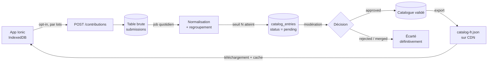

# 003 — Catalogue collaboratif

| | |
| --- | --- |
| **Statut** | ⏸️ Conçue, non implémentée — reportée |
| **Date** | 20/08/2026 |
| **Condition de reprise** | Une base d'utilisateurs réelle. Implique un backend. |
| **Suivi** | [v2.0 dans le suivi des versions](../suivi-versions.md) |

L'idée : la base locale reste la source de vérité, mais l'utilisateur peut **accepter
explicitement** de partager sa liste d'aliments pour enrichir un catalogue communautaire.

Le format de fichier produit serait **identique** à celui de la
[décision 002](002-catalogue-embarque.md). Seule la *source* du
fichier change (généré par le backend au lieu d'être écrit à la main) : la migration est donc
transparente côté application, sans refactor.

## Architecture cible



Point essentiel : l'application **ne requête jamais le backend à chaque frappe**. Elle
télécharge périodiquement un snapshot JSON statique versionné (`ETag`), le met en cache local,
et l'autocomplétion reste instantanée et totalement offline.

## Le mécanisme central : seuil de publication k-anonyme

Ne publier un aliment dans le catalogue que s'il a été observé chez **au moins N utilisateurs
distincts** (N = 5 à 10). Ce seuil unique apporte quatre garanties simultanées :

- **Pré-filtrage automatique** — un nom injurieux ou farfelu saisi par une seule personne
  n'atteint même pas la file de modération.
- **Qualité** — « Lait » passe, « lait bio du marché de mardi » ne passe pas.
- **Confidentialité** (k-anonymat) — aucune entrée publiée n'est rattachable à un individu.
- **Pertinence** — le compteur d'occurrences devient le score de tri de l'autocomplétion.

## Modération : un statut, pas un booléen

Le seuil ne suffit pas seul : une bêtise suffisamment répandue finira par le franchir. On ajoute
donc une validation humaine — mais avec un **statut** plutôt qu'un flag `toValidate` booléen.

```
status : pending | approved | rejected | merged
```

Un booléen ne sait pas exprimer « rejeté ». Conséquence : le job quotidien reverrait l'entrée
comme non validée et la remettrait dans la file **à chaque exécution**, indéfiniment. Le rejet
doit être une décision mémorisée et définitive.

Le statut `merged` sert aux variantes : « Lait demi-écrémé » pointe vers l'entrée canonique
« Lait » via un champ `canonical_id`, au lieu d'être supprimée. On conserve ainsi le lien pour
les contributions futures portant le même libellé, qui sont alors rattachées automatiquement.

Champs utiles sur la table `catalog_entries` :

| Champ | Rôle |
| --- | --- |
| `status` | `pending` / `approved` / `rejected` / `merged` |
| `canonical_id` | entrée cible lorsque `status = merged` |
| `occurrences` | nombre de contributeurs distincts (tri de la file **et** de l'autocomplétion) |
| `reviewed_at`, `reviewed_by` | traçabilité des décisions |
| `reject_reason` | facultatif, utile pour rejeter en masse des motifs récurrents |

Seules les entrées `approved` sont exportées dans le snapshot JSON.

## L'interface de modération

Le job quotidien alimente une file triée par `occurrences` décroissantes : on modère d'abord ce
qui a le plus d'impact, et la longue traîne peut attendre. En pratique le volume à traiter est
faible, puisque le seuil a déjà écarté l'essentiel du bruit.

**Commencer directement en base** (requêtes SQL manuelles) est parfaitement raisonnable :
volume réduit, aucun développement, aucune surface d'attaque supplémentaire. Une interface
graphique ne se justifie que si la modération devient régulière ou doit être déléguée.

⚠️ Si une interface est développée, c'est **le composant le plus sensible du système** : une
console d'administration exposée sans contrôle d'accès correct est la faille n° 1 de l'OWASP
Top 10 (*Broken Access Control*). Exigences minimales : authentification réelle, autorisation
vérifiée côté serveur sur **chaque** endpoint (jamais uniquement dans l'UI), journalisation des
décisions, protection CSRF, et échappement systématique à l'affichage — les libellés proviennent
d'utilisateurs anonymes, donc du contenu non fiable par définition.

## Confidentialité et RGPD

Une liste de courses est plus révélatrice qu'il n'y paraît : régime alimentaire, convictions
religieuses (halal, casher), santé (sans gluten, produits pour diabétiques), composition du
foyer (lait infantile, petits pots). Certaines de ces informations relèvent des **catégories
sensibles** du RGPD. Contraintes non négociables :

- **Opt-in explicite**, jamais coché par défaut, réversible à tout moment, avec un texte
  indiquant précisément ce qui est transmis. Emplacement naturel : menu Options, à côté de la
  sauvegarde des données.
- **Transmettre uniquement** `name`, `unit`, `location`, `lang`. Jamais les quantités, notes,
  images, dates ou seuils minimaux : ils ne servent pas au catalogue et sont bien plus intrusifs.
- **Aucun identifiant utilisateur persistant.** Pour compter des contributeurs distincts sans
  identifier personne : un UUID aléatoire local, dédié à cet usage, réinitialisable, non lié à
  l'appareil.
- **Rétention limitée** : purge de la table brute après agrégation (~30 jours), conservation
  des seuls compteurs agrégés.
- Politique de confidentialité publiée, obligatoire.

## Le vrai travail : la normalisation, pas la déduplication

Regrouper « Lait », « lait », « LAIT », « Lai » demande une chaîne de traitement :

1. Trim, passage en minuscules, compression des espaces multiples, suppression de la
   ponctuation terminale.
2. Suppression des diacritiques pour la **clé de regroupement**, en conservant la forme
   accentuée la plus fréquente comme libellé affiché.
3. Rapprochement des variantes proches (fautes de frappe, singulier/pluriel). En PostgreSQL,
   `pg_trgm` avec un index GIN couvre ce besoin par similarité trigramme, sans dépendance externe.
4. Libellé canonique = variante la plus fréquente du groupe.
5. Unité et lieu majoritaires du groupe → valeurs de pré-remplissage.

## Anti-abus

- Limitation de débit par IP, plafond de taille de lot.
- Longueur maximale du nom (~60 caractères).
- Rejet des chaînes contenant URL, email ou numéro de téléphone — quelqu'un finira par essayer.
- Envoi par lots différés (une fois par semaine au maximum), file d'attente locale si hors-ligne.

## Réserve

Cette étape fait passer le projet d'une application sans infrastructure à une application avec
backend, base de données, tâche planifiée, hébergement, politique de confidentialité et
obligations RGPD. C'est un engagement de maintenance permanent pour une fonctionnalité de
confort. Le [catalogue statique embarqué](002-catalogue-embarque.md) couvre déjà l'essentiel du
besoin pour un coût quasi nul.
